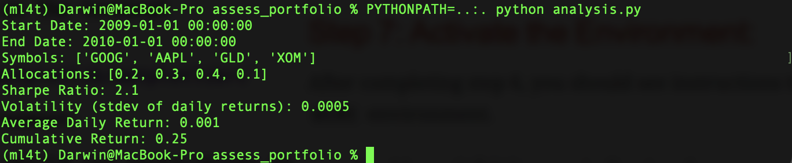

# Setup ML4T Environment

## Step 1:

### Go to course site, create directory ML4T and extract the following:
https://www.dropbox.com/s/a7pfwbi365dos7l/ML4T_2022Fall.zip?dl=1[ML4T files]

## Step 2:
### On the same ML4T directory download the following:
https://www.dropbox.com/s/ouifx3kqb2g5k4y/assess_portfolio_2022Fall.zip?dl=1[Access Portfolio]

## Step 3: Download Miniconda

If you have a MAC M1 Chip computer, Ensure that you select the M1 64 bit bash file from the miniconda site.

Miniconda can be downloaded here: https://docs.conda.io/en/latest/miniconda.html[Miniconda3 macOS Apple M1 64-bit bash]

On the terminal, cd into the directory where Mini Conda was downloaded. 

Then on the terminal type: `sh ./name_of_mini_conda_file`

where name_of_mini_conda_file is the name of the file that you downloaded. 

Select yes whenever asked. If by any chance you had installed a different sh file for the wrong version of miniconda, delete the miniconda file folder and try to repeat this step all over.

Close the Command Line Interface (CLI) and reopen it again. When you reopen CLI, you should see `(base)` in front of the prompt line. Then Type `conda` and ensure that conda documentation is displayed. If so, then you installed successfully.

## Step 4: Configuration File: 

go to the following link and copy the configuration settings on a blank notepad document or using an editor from the CLI such as VI or nano.

https://lucylabs.gatech.edu/ml4t/fall2022/local-environment/

Or you can you copy the following code (as the date of this posting, it's meant for software dependancies for the Fall 2022 semester)
https://gist.githubusercontent.com/CS7646-ML4T/69da123d8c4999b2ac99397a6b01807d/raw/20a0312f4dbf2bb10df7a23a9597659b9eac1305/environment.yml[environment yml configuration]

Save this file on the root directory of your workstation.

## Step 5: Create ML4T Environment

go back to link:

https://lucylabs.gatech.edu/ml4t/fall2022/local-environment/

and on that page copy:
`conda env create --file environment.yml` 

then paste that command on the CLI on the root directory to create the ml4t environment

on the root directy copy and paste `conda activate ml4t` on the root environment

If you are using a MAC M1, you may get an error that some dependencies failed to installed. In that case,

Follow the below instructions from the ML4T site:

### M1 Mac Conda Setup (Student Supplied)

Copy the environment.yaml in the instructions file to your local machine and specify Rosetta mode by creating the environment using the following command:
`CONDA_SUBDIR=osx-64 conda env create -f environment.yaml`

which resolves the *ResolvePackageNotFound*  issues.

Setting the environment variable CONDA_SUBDIR=osx-64 forces conda to install Intel packages. These run under emulation and will have a performance impact.

Attempted with both miniforge3-4.10.3-10 and anaconda3-2022.05.

## Step 6: Workarounds for MAC OS

Copy and paste the following on the terminal

`mkdir -p ~/.matplotlib`
`echo "backend: TkAgg" > ~/.matplotlib/matplotlibrc`

## Step 7: Activate the Environment:

After completing step 6, you should see instructions to activate the `ml4t` environment. 

you should see `(ml4t)` as an indication that you succesfully created and activated the environment.

## Testing Environment

Ensure that ml4t environment is activated. 

Go to the ml4t folder that was created at the beginning in *Step 1*

inside the ml4t directory, go to `assess_portfolio` directory. Ensure that file `analysis.py` is inside this directory. 

On the CLI, type: `PYTHONPATH=..:. python analysis.py`

you should see the following:

